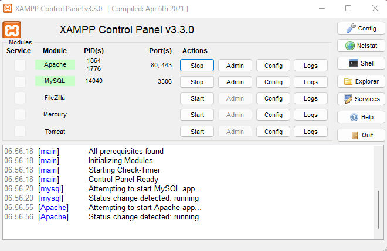
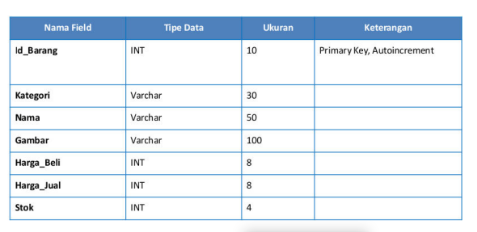
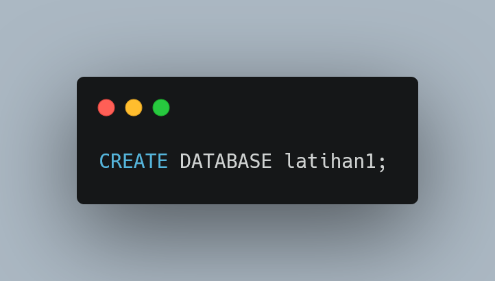
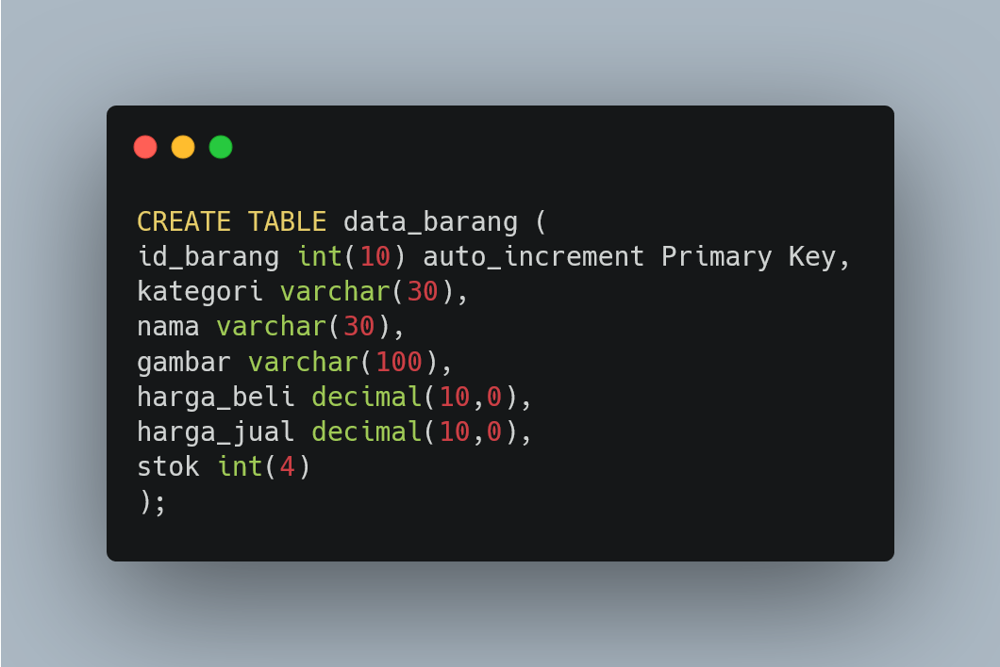
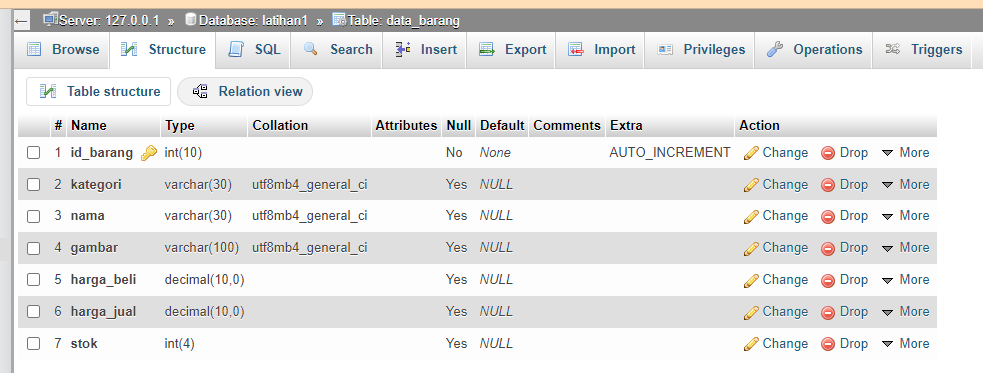
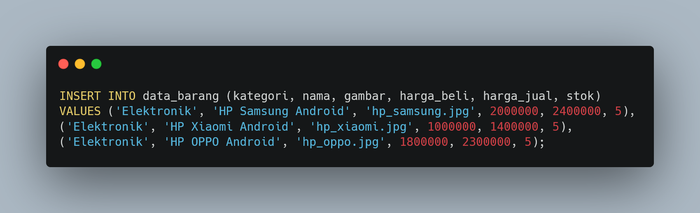
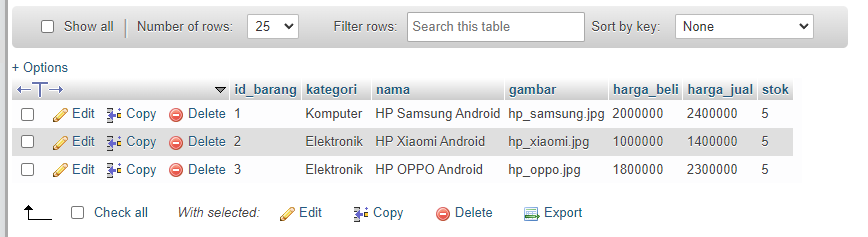
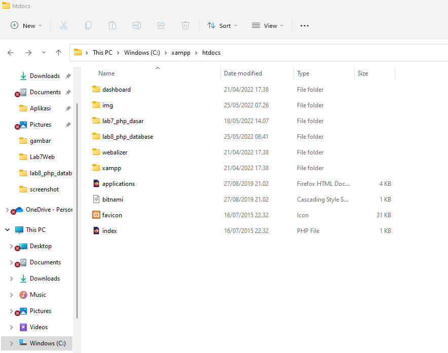

# Lab8Web

| Nama      | Faris Syahluthfi |
| ----------- | ----------- |
| NIM     | 312010034       |
| Kelas   | TI.20.A.1        |

## Langkah langkah praktikum 8

## 1. Persiapan
Untuk memulai membuat aplikasi CRUD sederhana, yang perlu disiapkan adalah
database server menggunakan MySQL. Pastikan MySQL Server sudah dapat dijalankan
melalui XAMPP.

## 2. Menjalankan MySQL Server
Untuk menjalankan MySQL Server dari menu XAMPP Contol.


## 3. Mengakses MySQL Client menggunakan PHP MyAdmin
Pastikan webserver Apache dan MySQL server sudah dijalankan. Kemudian buka
melalui browser: http://localhost/phpmyadmin/


## 4. Membuat Database: Studi Kasus Data Barang



## 5. Membuat Database


## 6. Membuat Tabel



## 7. Menambahkan Data



## 8. Membuat Program CRUD
Buat folder lab8_php_database pada root directory web server (d:\xampp\htdocs)



### Perulangan while
## **Codingannya** ##
```PHP
<?php
echo "Perulangan 1 sampai 10 <br />";
$i=1;
while ($i<=10) {
echo "Perulangan ke: " . $i . '<br />';
$i++;
}
?>
```


### Perulangan dowwhile
## **Codingannya** ##
```PHP
<?php
echo "Perulangan 1 sampai 10 <br />";
$i=1;
do {
echo "Perulangan ke: " . $i . '<br />';
$i++;
} while ($i<=10);
?>
```


## Pertanyaan dan Tugas
Buatlah program PHP sederhana dengan menggunakan form input yang menampilkan
nama, tanggal lahir dan pekerjaan. Kemudian tampilkan outputnya dengan menghitung
umur berdasarkan inputan tanggal lahir. Dan pilihan pekerjaan dengan gaji yang
berbeda-beda sesuai pilihan pekerjaan.

## Jawab
```PHP
<!DOCTYPE html>
<html lang="en">

    <head>
        <title>Form Input</title>
        <meta charset="utf-8">

        <!-- CSS -->
        <style>
        body {
            width: 100%;
            height: 100vh;
            margin: 0;
            font-family: tahoma;
            font-size: 16px;
        }
        h1, p {
            margin: 1em auto;
            text-align: center;
        }
        form {
            width: 60vw;
            max-width: 500px;
            min-width: 300px;
            margin: 0 auto;
            padding-bottom: 2em;
            }
        label {
            display: block;
            margin: 0.5rem 0;
        }
        button[type="submit"] {
            display: block;
            width: 60%;
            margin: 1em auto;
            height: 2em;
            font-size: 1.1rem;
            background-color: #00FF00;
            border-color: white;
            min-width: 300px;
        }
        </style>
    </head>

    <body>
        <h1 id="title">Survey Formulir Pekerjaan dan Gaji</h1>
        <p id="description"><i>Melansir dari situs <a href="https://www.jobstreet.co.id/id/job-search/it-jobs/"> jobstreet.co.id</a></i></p>

        <form id="survey-form" action="" method="POST">
            <fieldset>
                <label>Nama: 
                    <input type="text" name="nama" required/>
                </label>
                <label>Tanggal lahir: 
                    <input type="date" name="date">
                </label>
                <label>Pekerjaan: 
                    <label>
                    <input type="radio" name="job" value="0"/>System Analyst
                    </label>
                    <label>
                    <input type="radio" name="job" value="1"/>IT Support
                    </label>
                    <label>
                    <input type="radio" name="job" value="2"/>System Administrator
                    </label>
                </label>
                <button type="submit" name="submit">Submit</button>
            </fieldset>
            <fieldset>
                <?php
                if( isset($_POST['submit']))
                {
                    $nama = $_POST['nama'];
                    $date = $_POST['date'];
                    $job = $_POST['job'];


                    $date_user = new DateTime($date);
                    $today =  new DateTime('today');
                    $usia = $today->diff($date_user)->y;

                    $job_array = ["System Analyst","IT Support","System Administrator"];
                    $salary_array = ["Rp. 8.000.000","Rp. 6.400.000","Rp. 4.200.000"];


                    echo "Halo, ".$nama."<br>Kamu lahir pada tanggal ".$date.", Usia mu ".$usia." tahun";
                    echo "<br>Pekerjaan yang anda pilih adalah ".$job_array[(int)$job].", dengan penghasilan kurang lebih ".$salary_array[(int)$job];
                }
                ?>
            </fieldset>
        </form>
    </body>
</html>
```
## Hasil Outputnya Sebagai Berikut :
